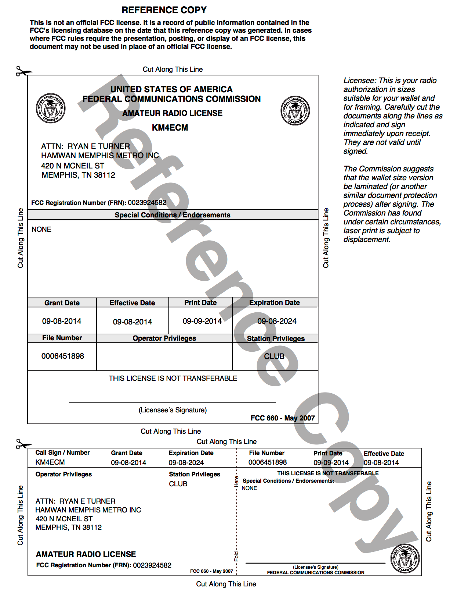

# Safety and Engineering Binder for HamWAN Memphis Metro Installation at the Olive Branch Water Tower on Craft Rd

## Introduction

This document exists to provide on-site reference materials about the equipment installed on premesis, especially for troubleshooting and incident response purposes. It is not meant to be a complete record of every device installed. The source of this is maintained on the HamWAN Deployment Engineering repository, and discussion of its content may be facilitated there.

### Safety Warnings

**WARNING: Radio Frequency Fields on roof above the elevator room exceed the FCC general public exposure limit.**

Obey all posted signs and site guidelines for working in radio frequency environments. In accordance with Federal Communications Commission rules on radio frequency emissions 47 CFR 1.1307(b).

## Systems Design and Deployment

### Physical Devices (Layer 1)

Assets may be viewed in the [asset tracker](https://github.com/memhamwan/inventory/issues?utf8=✓&q=label%3Acrw).

### RF Spectrum Plan

| Radio    | Frequency | Channel Width |
| -------- | --------- | ------------- |
| omn1.crw | 5865 MHz  | 5MHz          |
| leb.crw  | MHz       | 20MHz         |

## Licensing and Permitting

### RF Spectrum

All transmitters at this location are operating using the FCC license below or within the U-NII FCC regulatory domain.

