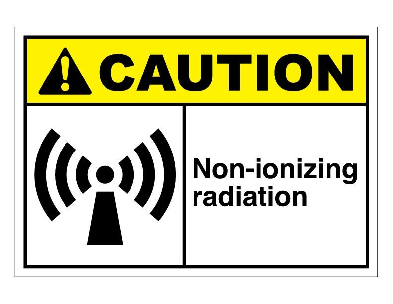

## Introduction

This document exists to provide on-site reference materials about the equipment installed on premesis, especially for troubleshooting and incident response purposes. It is not meant to be a complete record of every device installed. The source of this is maintained on the HamWAN Deployment Engineering repository, and discussion of its content may be facilitated there.

### Safety Warnings

**WARNING: Radio Frequency Fields on roof above the elevator room exceed the FCC general public exposure limit.**

Obey all posted signs and site guidelines for working in radio frequency environments. In accordance with Federal Communications Commission rules on radio frequency emissions 47 CFR 1.1307(b).

## Systems Design and Deployment

### Physical Devices (Layer 1)

Assets may be viewed in the [asset tracker](https://github.com/memhamwan/inventory/issues?utf8=✓&q=label%3Aleb).

### RF Spectrum Plan

| Radio    | Frequency | Channel Width |
| -------- | --------- | ------------- |
| hil.leb  | 5765 MHz  | 20MHz         |
| mno.leb  | 5220 MHz  | 20MHz         |
| crw.leb  | 5200 MHz  | 20MHz         |
| azo.leb  | 5795 MHz  | 20/40MHz-eC   |
| sco.leb  | 5825 MHz  | 20MHz         |
| omn1.leb | 5865 MHz  | 5 MHz         |

## IP Addressing

| Hostname                      | Alias                              | IP            | 
|-------------------------------|------------------------------------|---------------| 
| r1.leb.memhamwan.net          | ether1.r1.leb.memhamwan.net        | 44.34.128.161 | 
| r2.leb.memhamwan.net          |                                    | 44.34.128.162 | 
| ptpsco.leb.memhamwan.net      | ether1.ptpsco.leb.memhamwan.net    | 44.34.128.163 | 
| esxi1.leb.memhamwan.net       | eth0.esxi1.leb.memhamwan.net       | 44.34.128.164 | 
| papaya.leb.memhamwan.net      | papaya.leb.memhamwan.net           | 44.34.128.165 | 
| ilo.papaya.leb.memhamwan.net  | eth0.allstar.leb.memhamwan.net     | 44.34.128.166 | 
| dstar.leb.memhamwan.net       | eth0.dstar.leb.memhamwan.net       | 44.34.128.167 | 
| ptpcrw.leb.memhamwan.net      | ether1.ptpcrw.leb.memhamwan.net    | 44.34.128.168 | 
| blueiris.leb.memhamwan.net    |                                    | 44.34.128.169 | 
| ntp.leb.memhamwan.net         |                                    | 44.34.128.170 | 
| nvr.leb.memhamwan.net         |                                    | 44.34.128.171 | 
| idrac.esxi1.leb.memhamwan.net |                                    | 44.34.128.172 | 
|                               |                                    | 44.34.128.173 | 
| vrrp.leb.memhamwan.net        | vrrp.vrrp.leb.memhamwan.net        | 44.34.128.174 | 
|                               |                                    | 44.34.128.175 | 
|                               |                                    | 44.34.128.176 | 
|                               |                                    | 44.34.128.177 | 
| ???                           | ???                                | 44.34.128.178 | 
| ptphil.leb.memhamwan.net      | ether1.ptphil.leb.memhamwan.net    | 44.34.128.182 | 
| omn1.leb.memhamwan.net        | ether1.omn1.leb.memhamwan.net      | 44.34.128.183 | 
| ptpazo.leb.memhamwan.net      | ether1.ptpazo.leb.memhamwan.net    | 44.34.128.184 | 
| allstar-dmr.leb.memhamwan.net | eth0.allstar-dmr.leb.memhamwan.net | 44.34.128.185 | 
|                               |                                    | 44.34.128.186 | 
| ptpmno.leb.memhamwan.net      | ether1.ptpmno.leb.memhamwan.net    | 44.34.128.187 | 
|                               |                                    | 44.34.128.188 | 
|                               |                                    | 44.34.128.189 | 
|                               |                                    | 44.34.128.190 | 
|                               | wlan1.omn1.leb.memhamwan.net       | 44.34.128.209 | 
|                               | wlan1.ptpazo.leb.memhamwan.net     | 44.34.131.142 | 
|                               | wlan1.ptpcrw.leb.memhamwan.net     | 44.34.131.145 | 
|                               | wlan1.ptphil.leb.memhamwan.net     | 44.34.131.130 | 
|                               | wlan1.ptpmno.leb.memhamwan.net     | 44.34.131.141 | 
|                               | wlan0.ptpsco.leb.memhamwan.net     | 44.34.131.132 | 
|                               | sstp1.r1.leb.memhamwan.net         | 44.34.130.8   | 

## Licensing and Permitting

### RF Spectrum

All transmitters at this location are operating using the FCC license below or within the U-NII FCC regulatory domain.

